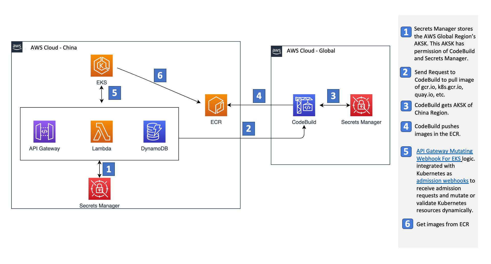

# Automate Image Pulling together with [Amazon API Gateway Mutating Webhook For K8S](https://github.com/aws-samples/amazon-api-gateway-mutating-webhook-for-k8) 


The solution is working with [Amazon API Gateway Mutating Webhook For K8S](https://github.com/aws-samples/amazon-api-gateway-mutating-webhook-for-k8). Particularly this project will complete docker images pulling together with mutating webhook to modify the docker image path in K8S Pod after the deployment been submitted to K8S API server and before it's been persisted in etcd.


## Use cases

- Resolve the docker images pulling from gcr.io, k8s.gcr.io, quay.io and etc. 
- Automate the docker images pulling whenever the K8S resources  


## How to deploy
### Prerequisites
- At first, please follow the prerequisites of [Amazon API Gateway Mutating Webhook For K8S](https://github.com/aws-samples/amazon-api-gateway-mutating-webhook-for-k8)
- An AWS Global IAM user with CloudFormation, CodeBuild and Secrets Manager permissions, it will be used to pull docker images from gcr.io or other source.   
- An AWS China IAM user with ECR permissions and it will be used to push docker images to ECR in AWS China.  
- In AWS China Region, [preparing a secret](https://docs.aws.amazon.com/secretsmanager/latest/userguide/create_secret.html) with AWS Global IAM user's Access Key and Access Secret Key in Secret Manager.

### Steps to set up admission webhook:

1. In AWS China Region, [preparing a secret](https://docs.aws.amazon.com/secretsmanager/latest/userguide/create_secret.html) with Secret Manager. The values are G_AWS_REGION means Global Region, G_ACCESS_KEY and G_SECRET_KEY means access key and secret key in Global.

2. In AWS Global Region, create CloudFormation Stack with image-pulling.yaml, CodeBuild Project and Secrets Manager resources will be created.

3. The following steps are same as [Amazon API Gateway Mutating Webhook For K8S](https://github.com/aws-samples/amazon-api-gateway-mutating-webhook-for-k8). It lists below:

    Firstly please install AWS CLI and SAM CLI by following [AWS SAM documentation](https://docs.aws.amazon.com/serverless-application-model/latest/developerguide/serverless-sam-cli-install.html)
    
    1). Check out this repository 

    ```sh
    $ git clone https://github.com/walkingerica/automate-pulling-and-mutating-webhook-for-eks.git
    $ cd automate-pulling-and-mutating-webhook-for-eks
    ```

    2). Build the SAM package, replace my_s3_bucket with your S3 bucket name at first.

    ```sh
    $ export S3_BUCKET=my_s3_bucket
    $ sam package -t sam-template.yaml --s3-bucket ${S3_BUCKET} --output-template-file packaged.yaml
    ```

    3). Deploy SAM package

    ```sh
    $ sam deploy -t packaged.yaml --stack-name amazon-api-gateway-mutating-webhook-for-k8 --capabilities CAPABILITY_IAM
    ```
	2). Go to the cloudformation stack console, find the stack which name is serverlessrepo-amazon-api-gateway-mutating-webhook-for-k8s if you are are using SAR deployment in previous step, or find the stack with name amazon-api-gateway-mutating-webhook-for-k8, get APIGatewayURL from the outputs of this stack.

	3). Create k8s MutatingWebhookConfiguration resource
    - Modify mutating-webhook.yaml，replace <WEB-HOOK-URL> with the value of APIGatewayURL
    - Create K8S resource:
        ```bash
        $ kubectl apply -f mutating-webhook.yaml
        ```
	4). Deploy sample k8s deployment
    ```bash
    $ kubectl apply -f ./nginx-gcr.yaml
    ```
	5). Check the image path 
    ```bash
    $ kubectl get pod nginx-gcr-deployment-784bf76d96-hjmv4 -o=jsonpath='{.spec.containers[0].image}'
    asia.gcr.io/nginx
    ```
    you may noticed the image path has been changed from "gcr.io/nginx" to "asia.gcr.io/nginx"


## How it works


1. Secrets Manager stores the AWS Global Region’s AKSK. This AKSK has permission of CodeBuild 
and Secrets Manager.

2. Send Request to CodeBuild to pull image of gcr.io, k8s.gcr.io, quay.io, etc.

3. CodeBuild gets AKSK of China Region.

4. CodeBuild pushes images in the ECR.

5. [Amazon API Gateway Mutating Webhook For K8S](https://github.com/aws-samples/amazon-api-gateway-mutating-webhook-for-k8) logic.

6. Get images from ECR


## What it Adds

1. A CodeBuild and Secret Manager deployment to get the docker images and push them to ECR in China region. The main logic is in the image-pulling.yaml.
	```
	Source:
        Type: NO_SOURCE
        BuildSpec: !Sub |
          version: 0.2
          env:
            variables:
              DOCKER_IMAGE: "test"
              NEW_DOCKER_IMAGE: "test"
            secrets-manager:
              AWS_DEFAULT_REGION: ImagePullSecret:Region
              AWS_ACCESS_KEY_ID: ImagePullSecret:AccessKey
              AWS_SECRET_ACCESS_KEY: ImagePullSecret:AccessSecretKey

          phases:
            pre_build:
              commands:
                - $(aws ecr get-login --region $AWS_DEFAULT_REGION --no-include-email)
            build:
              commands:
                - docker pull $DOCKER_IMAGE && docker tag $DOCKER_IMAGE $NEW_DOCKER_IMAGE && docker push $NEW_DOCKER_IMAGE
    ```
2. In the sam-template.yaml, 
- A DynamoDB table is added to verify if this docker image was pulling. 

    ```sh
    ImageListTable:
    Type: AWS::DynamoDB::Table
    Properties:
      TableName: ImageListTable
      AttributeDefinitions:
        - AttributeName: repo
          AttributeType: S
        - AttributeName: tag
          AttributeType: S
      KeySchema: 
        - AttributeName: repo
          KeyType: HASH
        - AttributeName: tag
          KeyType: RANGE  
      BillingMode: PAY_PER_REQUEST
    ```
- Environment Variables settings, including Global Secrets Manager's secret name, the DynamoDB table in the above step and Global CodeBuild project's name which we created in Step 2.

    ```sh
    Environment:
        Variables:
          DDB_TABLE_NAME: !Ref ImageListTable
          GLOBAL_AKSK: GlobalAKSK
          G_PROJECT_NAME: ImagePullProject
    ```
- Lambda Policies.
    ```sh
    Policies:
       - SecretsManagerReadWrite
       - AmazonDynamoDBFullAccess
       - AmazonEC2ContainerRegistryFullAccess

    ```

 3. In the lambda_function.py,
 - Send pulling images'request to CodeBuild project in AWS global.
 - A special adding for sha256 containing docker images since we found it is used in some images. 

 	```sh
 	def create_codebuild(docker_image, new_docker_image):

    credentials = get_secret()
    print(credentials)

    global_region = credentials['G_AWS_REGION']
    global_access_key = credentials['G_ACCESS_KEY']
    global_secret_key = credentials['G_SECRET_KEY']

    codebuild = boto3.client(
            'codebuild',
            region_name=global_region,
            aws_access_key_id=global_access_key,
            aws_secret_access_key=global_secret_key)

    try:
        print('docker_image %s, new_docker_image %s.'
                        % (docker_image, new_docker_image))

        try:
            resp = tab.put_item(
                Item={
                    'repo': new_docker_image.split(':')[0],
                    'tag': new_docker_image.split(':')[1]
                },
                ConditionExpression=
                'attribute_not_exists(repo) AND attribute_not_exists(tag)'
                )
        except ClientError as e:
            if e.response['Error'][
                    'Code'] == 'ConditionalCheckFailedException':  # If the DDB item exists there will be a started build
                print(
                    "The item exists and the there should be a existed build!")
                return
            else:
                print("DDB put item unkown error!")
                print(e)


        codebuild.start_build(projectName=project_name,
                              environmentVariablesOverride=[{
                                  "name": "DOCKER_IMAGE",
                                  "value": docker_image,
                                  "type": "PLAINTEXT"
                              }, {
                                  "name": "NEW_DOCKER_IMAGE",
                                  "value": new_docker_image,
                                  "type": "PLAINTEXT"
                              }])
    except ClientError as e:
        print("Start global codebuild project error!")
        print(e)
    ```
